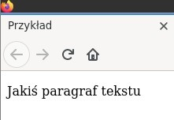
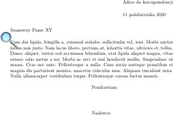

# Lekcja 1 – Markdown lekki język znaczników

## Wstęp
Obecnie powszechnie wykorzystuje się języki ze znacznikami do opisania dodatkowych informacji umieszczanych w plikach tekstowych. Z pośród najbardziej popularnych można wspomnieć o:
1.	html – służącym do opisu struktury informacji zawartych na stronach internetowych,

2.	Tex (Latex) – poznany na zajęciach język do „profesjonalnego” składania tekstów,

3.	XML (Extensible Markup Language) - uniwersalnym języku znaczników przeznaczonym do reprezentowania różnych danych w ustrukturalizowany sposób.

Przykład kodu html i jego interpretacja w przeglądarce:

```html
<!DOCTYPE html>
<html>
<head>
<meta charset="utf-8" />
<title>Przykład</title>
</head>
<body>
<p> Jakiś paragraf tekstu</p>
</body>
</html>
```


Przykład kodu Latex i wygenerowanego pliku w formacie pdf
```Latex
\documentclass[]{letter}
\usepackage{lipsum}
\usepackage{polyglossia}
\setmainlanguage{polish}
\begin{document}
\begin{letter}{Szanowny Panie XY}
\address{Adres do korespondencji}
\opening{}
\lipsum[2]
\signature{Nadawca}
\closing{Pozdrawiam}
\end{letter}
\end{document}
```


Przykład kodu XML – fragment dokumentu SVG (Scalar Vector Graphics)
```xml
<!DOCTYPE html>
<html>
<body>
<svg height="100" width="100">
<circle cx="50" cy="50" r="40" stroke="black" stroke-width="3" fill="red" />
</svg>
</body>
</html>
```


W tym przypadku mamy np. znacznik np. <circle> opisujący parametry koła i który może być właściwie zinterpretowany przez dedykowaną aplikację (np. przeglądarki www).

Jako ciekawostkę można podać fakt, że również pakiet MS Office wykorzystuje format XML do przechowywania informacji o dodatkowych parametrach formatowania danych. Na przykład pliki z rozszerzeniem docx, to nic innego jak spakowane algorytmem zip katalogi z plikami xml.

Przykład rozpakowania zawartości pliku test.docx poleceniem: **unzip**

$unzip -l test.docx 

Archive: test.docx

|Length|Date|Time|Name|
|:-----|:---|:---|:---|
|573|2022-03-20|08:55|_rels/.rels|
|731|2022-03-20|08:55|docProps/core.xml
|508|2022-03-20|08:55|docProps/app.xml
|531|2022-03-20|08:55|word/_rels/document.xml.rels
|1288|2022-03-20|08:55|word/document.xml
|2429|2022-03-20|08:55|word/styles.xml
|853|2022-03-20|08:55|word/fontTable.xml
|257|2022-03-20|08:55|word/settings.xml
|1374|2022-03-20|08:55|[Content_Types].xml
